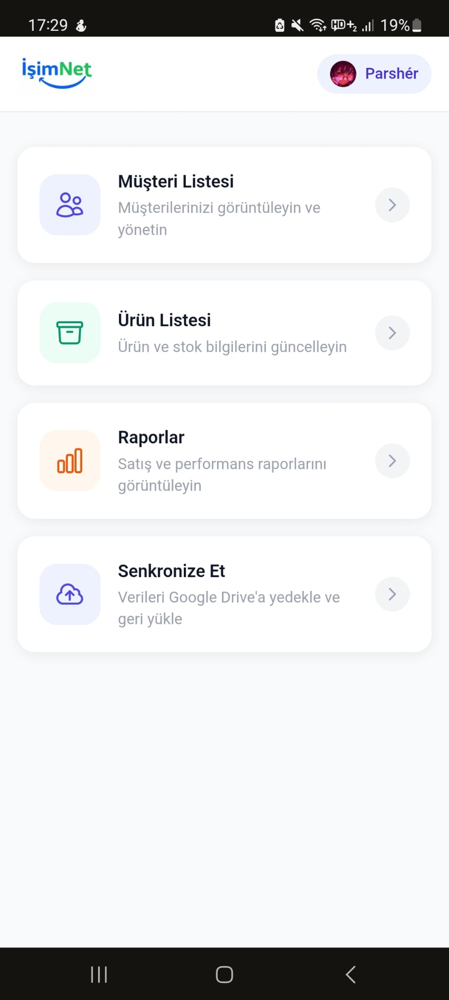
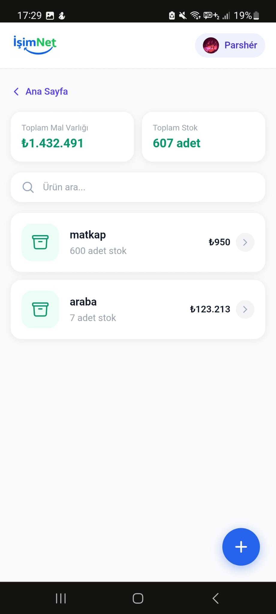
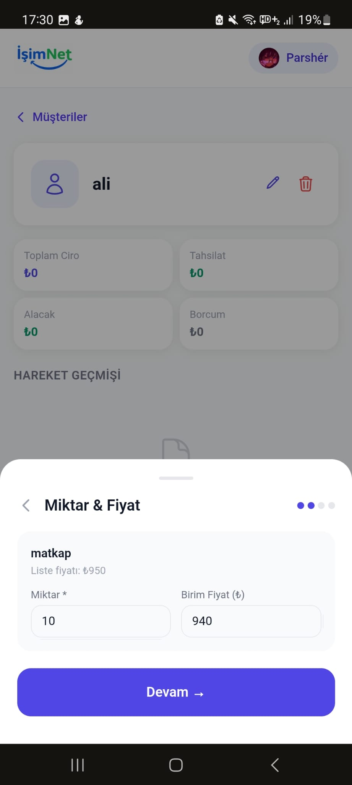
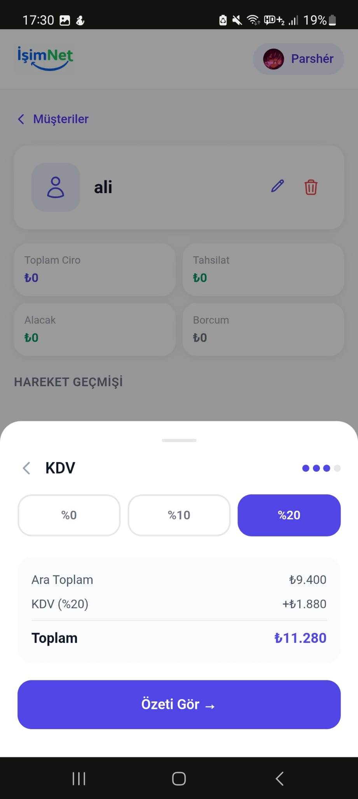
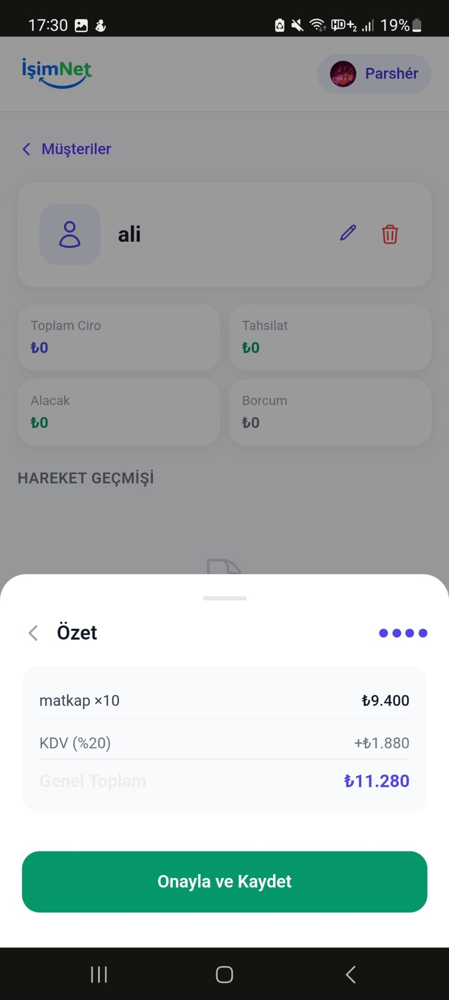
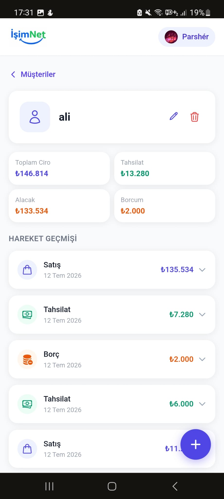
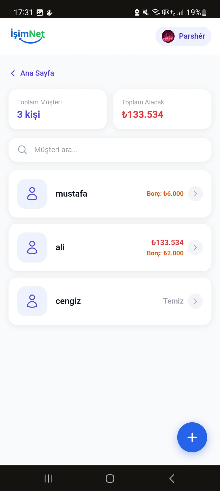
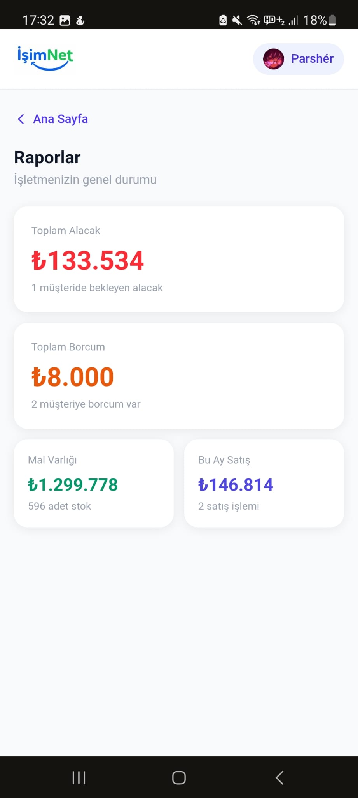
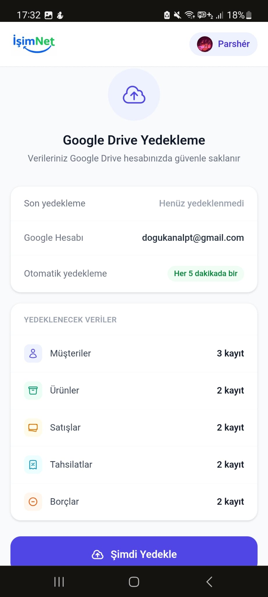

<p align="center">
  
</p>

<h1 align="center">İşimNet</h1>

<p align="center">
  Küçük ve orta ölçekli işletmeler için <strong>müşteri cari hesabı</strong> ve <strong>ürün stok yönetimi</strong>.<br/>
  Veriler Google Drive'da, her cihazdan erişim, hiçbir sunucu maliyeti yok.
</p>

<p align="center">
  
  
  
  
  
</p>

---

## Ekran Görüntüleri

<p align="center">
  
  
  
</p>
<p align="center">
  
  
  
</p>
<p align="center">
  
  
  
</p>

---

## Özellikler

<table>
<tr>
<td width="50%" valign="top">

**Müşteri & Cari Hesap**
- Müşteri bazında toplam satış, tahsilat ve güncel alacak
- Kronolojik hareket geçmişi (satış + tahsilat birlikte)
- Arama ve borç özeti kartları

**Ürün & Stok**
- Ürün kartları — stok miktarı ve birim fiyat
- Satış kaydında stok otomatik düşümü
- Toplam mal varlığı hesaplama (Fiyat × Stok)

</td>
<td width="50%" valign="top">

**Satış & Tahsilat**
- KDV seçeneği: %0, %10, %20 (satış bazında)
- Çoklu ürünlü satış, fiyat düzenleme
- Tahsilat girişi — borca otomatik mahsup

**Veri & Senkronizasyon**
- Veriler Google Drive'da kullanıcıya özel JSON
- localStorage önbellek → anında açılış
- Offline çalışır, bağlantı gelince senkronize eder

</td>
</tr>
</table>

---

## Teknoloji

| Katman | Teknoloji |
|---|---|
| Framework | Next.js 16 (App Router) |
| Dil | TypeScript 5 |
| UI | React 19 + Tailwind CSS v4 |
| Auth | NextAuth.js v5 beta (Google OAuth) |
| Depolama | Google Drive API (kullanıcı başına JSON) |
| Önbellek | localStorage |
| Deploy | Vercel (Serverless) |

---

## Kurulum

### 1. Google Cloud Console

1. [console.cloud.google.com](https://console.cloud.google.com/) → **APIs & Services → Credentials**
2. **OAuth 2.0 Client ID** oluştur → Uygulama türü: **Web application**
3. Authorized redirect URI: `http://localhost:3000/api/auth/callback/google`
4. **APIs & Services → Library** → **Google Drive API** → Enable

### 2. Ortam Değişkenleri

```env
GOOGLE_CLIENT_ID=
GOOGLE_CLIENT_SECRET=
AUTH_SECRET=
NEXTAUTH_URL=http://localhost:3000
```

### 3. Çalıştır

```bash
git clone https://github.com/parsherr/IsimNet.git
cd IsimNet
npm install
npm run dev
```

`http://localhost:3000` adresinde açılır.

---

## Proje Yapısı

```
src/
├── app/
│   ├── api/
│   │   ├── auth/[...nextauth]/    # NextAuth route
│   │   └── sync/                  # Drive: GET yükle / POST kaydet
│   └── dashboard/
│       ├── musteriler/            # Müşteri listesi + detay
│       ├── urunler/               # Ürün listesi + detay
│       └── raporlar/              # Raporlar
├── context/
│   └── DataContext.tsx            # Global state — useData() hook
└── lib/
    ├── drive.ts                   # Google Drive yardımcıları
    ├── auth.ts                    # NextAuth yapılandırması
    ├── customers.ts               # Müşteri tipleri + buildActivityFeed
    ├── products.ts                # Ürün tipleri
    └── format.ts                  # Para birimi formatlama
```

---

## İş Kuralları

- **KDV** — ürün bazında değil satış bazında (%0 / %10 / %20)
- **Stok** — satış kaydedilince otomatik düşer
- **Tahsilat** — borçtan otomatik mahsup, ayrı kayıt tutulur
- **Toplam Mal Varlığı** = Σ (Fiyat × Stok)
- **Güncel Alacak** = Toplam Satış − Toplam Tahsilat

---

## Lisans

MIT